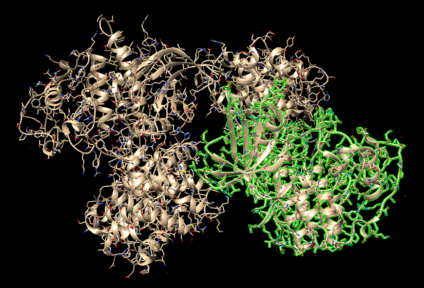
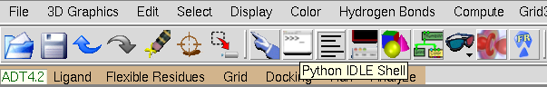

***

```{r setup, include=FALSE}
library(DiagrammeR)
knitr::opts_chunk$set(echo = TRUE)
```


## Obtención y preparación de las moléculas

### Ambiente de trabajo

1.  Crea una carpeta de trabajo para guardar los archivos que se irán generando.  
```{#numCode .R .numberLines}
mkdir wd_dk
cd wd_dk 
```

****

### Obtención de la Proteína

- Información sobre la proteína [CDK2](https://www.uniprot.org/uniprot/P24941).

#### Descarga de la proteína
        
1.  Abrir **UCSF Chimera** y en la opción "*File > Fetch by id...*" descargar del pdb la proteína **<mark>5IF1</mark>**.

```
/home/ssb/.local/UCSF-Chimera64-1.15rc/bin/chimera
```

2.  Ahora **guardamos** en un archivo `.pdb` únicamente los átomos de la proteína CDK2:
    a. Selecciona únicamente los átomos de la proteína CDK2:
        1. Visualiza todos los átomos del cristal mediante “*Actions > Atom/Bonds > show*”
        2. Ve a "*Favorites > Command Line*" ➡︎ Se abrirá una una línea de comandos en la parte inferior.
        3. En la línea de comandos escribe: `sel protein & :.a` ➡︎ Esto permite seleccionar únicamente los átomos de la proteína CDK2 de la [cadena A](https://www.rcsb.org/sequence/5IF1#A).
    b. Con los átomos seleccionados ir a "*File > Save PDB...*" y en la ventana que se abrirá seleccionar la opción "*Save selected atoms only*" y guardar el archivo `.pdb` de la proteína: **<mark>prot_unprep.pdb</mark>**

> <a href="https://www.virtualbox.org/wiki/Downloads">
    
</a>

#### Prepara la estructura de la proteína con [PDB2PQR](https://pdb2pqr.readthedocs.io/en/latest/using/):

1.  Tener el ambiente de conda `dock` activado y localizarse en la carpeta de trabajo (`wd_dk`).
2.  Ejecutar **PDB2PQR** con alguno de los siguientes comandos (dependiendo de la versión con la que cuentes):

```{#numCode .R .numberLines}
# Para la versión más reciente
pdb2pqr30 --ff='AMBER' --ffout='AMBER' \
    --with-ph=0.7 --drop-water --keep-chain \
    --pdb-output prot.pdb \
    prot_unprep.pdb pqr_file.pqr
```

```{#numCode .R .numberLines}
# Para versiones anteriores
pdb2pqr --ff=amber --with-ph=7.0 --ffout=amber \
    --ph-calc-method=propka \
    --chain prot_unprep.pdb prot.pdb
```

> Esto creará un nuevo archivo **<mark>prot.pdb</mark>** con la nomenclatura correcta en Amber y con los estados de protonación a pH 7 de los residuos ionizables.

#### prot.pdb

<div style="height: 350px; width: 100%; position: relative;" class='viewer_3Dmoljs justify-content-center border' data-href='https://raw.githubusercontent.com/jRicciL/Taller_Simulacion_Molecular/master/resurces/docking/prot.pdb' 
data-backgroundcolor='0x303030' 
data-style1='cartoon:color=spectrum' >
</div> 


```
📂 wd_dk
│  📜 prot_unprep.pdb
│  🗒 prot.pdb
```

****

### Obtención de la Molécula Ligante
Existen múltiples bases de datos para poder descargar librerías de moléculas, para efectos del taller recurriremos a la base de datos **[PubChem](https://pubchem.ncbi.nlm.nih.gov/)** para descargar la "estructura" de la molécula de ATP, que usaremos como ligando.

1. Da click en el siguiente link para acceder a Pubchem: [página ATP Puchem](https://pubchem.ncbi.nlm.nih.gov/compound/Adenosine-5_-triphosphate).
2. En la sección *2.1.4 Canonical Smiles* verás la siguiente cadena de texto que corresponde a la representación de la molécula en formato [SMILES](https://es.wikipedia.org/wiki/SMILES):

> `C1=NC(=C2C(=N1)N(C=N2)C3C(C(C(O3)COP(=O)(O)OP(=O)(O)OP(=O)(O)O)O)O)N`

3. Copia el SMILES en un archivo de texto en la carpeta de trabajo, guardándolo como **<mark>smiles_atp.smi</mark>**.
4. Ahora vamos a convertir el SMILES a formato `mol2` utilizando [Open Babel](http://openbabel.org/wiki/Main_Page). En una terminal, con el ambiente `dock` activado y estando en `wd_dk` ejecuta lo siguiente:

```{#numCode .R .numberLines}
obabel -ismi smiles_atp.smi \
    -omol2 -O ATP.mol2 \
    --gen3d \
    -p 7 \
    --partialcharge gasteiger
```

> Lo anterior permite convertir el SMILES a una estructura `mol2` utilizando el campo de fuerza para **generar las coordenadas 3d**, **añadir hidrógenos** a pH 7, y añadir **cargas parciales de Gasteiger**.
> Puedes revisar [aquí](https://openbabel.org/docs/dev/Command-line_tools/babel.html) más sobre la ejecución de `obabel`.

5. Explora el archivo **<mark>ATP.mol2</mark>** con un editor de texto y/o UCSF-Chimera para verificar que la estructura se haya generado correctamente.

```{#numCode .R .numberLines}
head -n 12 ATP.mol2
```

```
@<TRIPOS>MOLECULE
*****
 47 49 0 0 0
SMALL
GASTEIGER

@<TRIPOS>ATOM
      1 C           3.2487   -1.4840    1.0155 C.ar    1  UNL1        0.1205
      2 N           2.6622   -2.4623    0.2886 N.ar    1  UNL1       -0.2188
      3 C           1.7335   -2.1092   -0.6300 C.ar    1  UNL1        0.1472
      4 C           1.3906   -0.7463   -0.7500 C.ar    1  UNL1        0.1473
      5 C           2.1064    0.1471    0.0336 C.ar    1  UNL1        0.1674
```

#### ATP.mol2

<div style="height: 250px; width: 100%; position: relative;" class='viewer_3Dmoljs justify-content-center border' data-href='https://raw.githubusercontent.com/jRicciL/Taller_Simulacion_Molecular/master/resurces/docking/ATP.mol2' 
data-backgroundcolor='0x303030' 
data-style1='stick' >
</div> 

```
📂 wd_dk
│  📜 prot_unprep.pdb
│  📜 smiles_atp.smi
│  🗒 prot.pdb
│  🗒 ATP.mol2
```

***

## Autodock 4.2
### Preparación de los archivos necesarios para Docking (PDBQT)

En esta sección se preparan los archivos de la proteína y el ligando en formato [PDBQT](http://autodock.scripps.edu/faqs-help/faq/what-is-the-format-of-a-pdbqt-file/), los cuales son necesarios para la ejecución de AD4.

### Obtenci'on de los scripts a utilizar

Si estas usando la maquina virtual LINK
```
export PATH="/home/ssb/miniconda3/envs/ad4/MGLToolsPckgs/AutoDockTools/Utilities24/:"$PATH
```

#### Preparación del ligando

```{r, echo=FALSE}
mermaid("
graph LR
    A(ATP.mol2)-->|prepare_ligand4.py| B(ATP.pdbqt)
    class A, B mermaid_class;
    ", height = '80%', width = '100%')
```

Esta fase consiste en utilizar las coordenadas del archivo ATP.mol2 para generar un archivo [PDBQT](http://autodock.scripps.edu/faqs-help/faq/what-is-the-format-of-a-pdbqt-file/) al se le incluirá la siguiente información:

- **<mark>Q:</mark>** Cargas parciales de [Gasteiger](http://expertcomputationalchemistry.blogspot.com/2016/08/the-difference-between-kollman-charges.html?m=1).
- **<mark>T:</mark>** Tipo de Átomo según el campo de fuerza usado por AD4.

<div class="alert alert-dismissible alert-warning">
<h4 class="alert-heading">Recursos:</h4>
<ul>
<li>Más sobre los <strong>parámetros del campo de fuerza empleado por AD4</strong>, incluyendo los tipos de átomos usados y sus constantes asociadas: <a href="http://autodock.scripps.edu/faqs-help/faq/where-do-i-set-the-autodock-4-force-field-parameters"><em>AD4 force field parameters</em></a></li>
<li><a href="http://autodock.scripps.edu/faqs-help/how-to/how-to-prepare-a-ligand-file-for-autodock4"><em>How to prepare a ligand file for AutoDock4?</em></a></li>
</ul>
</div>


1. Activar el ambiente de conda `ad4` y localizarse en la carpeta de trabajo.
2. **Descargar** el siguiente archivo y colocarlo en la carpeta de trabajo: [prepare_ligand4.py](https://github.com/jRicciL/Taller_Simulacion_Molecular/raw/master/resurces/docking/prepare_ligand4.py)
3. Ejecutar el siguiente comando:

```{#numCode .R .numberLines}
# Genera el archivo PDBQT del ligando
pythonsh ./prepare_ligand4.py -l ATP.mol2 -v -o ATP.pdbqt \
    -d ligand_dict.py -U 'nphs' -C
```

> Puedes ejecutar simplemente `pythonsh ./prepare_ligand4.py` o abrir el archivo **<mark>prepare_ligand4.py</mark>** con un editor de texto para saber qué indica cada parámetro usado.  
> - Pon particular atención en los parámetros `-U 'nphs'` y `-C` usados.  
> - ¿Qué relación hay entre el parámetro `-U 'nphs'` y el modelo *[Unit-Atom](http://autodock.scripps.edu/faqs-help/faq/should-i-always-use-polar-hydrogens/?searchterm=united%20atom)* de Autodock?

4. Inspecciona el archivo de salida llamado **<mark>ligand_dict.py</mark>**, la información que contiene será necesaria más adelante.

```{#numCode .R .numberLines}
cat ligand_dict.py
```

```
summary = d = {}
d['ATP'] = {'atom_types': ['A', 'C', 'HD', 'N', 'NA', 'OA', 'P' ],
			'rbonds':15,
			'zero_charge' : [],
			}
```
> - ¿Qué tipos de átomo contiene la molécula de ATP?
> - ¿Cuántos enlaces rotables tiene?
> - ¿Hay algún átomo que no posee carga parcial?

5. Inspecciona el archivo **<mark>ATP.pdbqt</mark>** mediante un editor de texto. 

#### Preparación del receptor en formato PDBQT

```{r, echo=FALSE}
mermaid("
graph LR
    A(prot.pdb)-->|prepare_receptor4.py| B(prot.pdbqt)
    class A, B mermaid_class;
    ", height = '80%', width = '100%')
```

1. **Descargar** el archivo [prepare_receptor4.py](https://github.com/jRicciL/Taller_Simulacion_Molecular/raw/master/resurces/docking/prepare_receptor4.py) y guárdalo en la carpeta de trabajo.
2. Ejecuta lo siguiente:
   
```{#numCode .R .numberLines}
pythonsh ./prepare_receptor4.py -r prot.pdb -o prot.pdbqt -U 'nphs' -v
```

1. Inspecciona el archivo **<mark>prot.pdbqt</mark>** mediante un editor de texto, verifica que las cargas parciales y los tipos de átomos hayan sido añadidos.

```
📂 wd_dk
│  📜 prot_unprep.pdb
│  📜 smiles_atp.smi
│  📜 prot.pdb
│  📜 ATP.mol2
│  🗒 ligand_dict.py
│  🗒 prot.pdbqt
│  🗒 ATP.pdbqt
```

***

### Ejecución de Autogrid

#### Archivo de parámetros de Autogrid (GPF)

En este paso se creará un archivo de parámetros para el ejecutable `autogrid4`: el archivo `.gpf` (*grid parameter file*).

Este `gpf` es creado a partir de información del receptor y la(s) molécula ligando, y especifica lo siguiente:

- El espacio de búsqueda con respecto al receptor.
  - Centro y tamaño de la rejilla
- La distancia entre los nodos de la rejilla (resolución).
- Los tipos de átomos a usar en los ligandos y el receptor.

##### Determinar el centro y tamaño de la rejilla

1. Activar el ambiente de conda `ad4` y localizarse en la carpeta de trabajo.
2. Ejecutar:

```{#numCode .R .numberLines}
adt prot.pdbqt
```

> Esto abrirá la herramienta llamada **AutoDockTools** y cargará el archivo `pdbqt` de la proteína.

3. En el menú color café titulado como **<mark style='color: green'>ADT4.2</mark>** ve a *Grid > Grid Box...*

> <a href="https://www.virtualbox.org/wiki/Downloads">
    
</a>
   
4. En la nueva ventana podrás modificar el tamaño y posición de la caja que aparece en el visualizador.
5. Mueve los parámetros hasta posicionar la caja sobre el sitio activo de la proteína:

> <a href="https://www.virtualbox.org/wiki/Downloads">
    
</a>

> La imagen superior muestra un ejemplo de los parámetros elegidos.

6. Deja el parámetro de *Spacing (angstrom)* con su valor por defecto: $0.375$.
7. 🚨 **Toma nota de los parámetros**, es decir, de las dimensiones en $x, y, z$ de la caja, así como de la posición $x,y,z$ de la misma. 

##### Crear el archivo GPF

```{r, echo=FALSE}
mermaid("
graph LR
    A(prot.pdbqt)--oC[prepare_gpf4.py]
    B(ATP.pdbqt)--oC
    C --> D(GPF.gpf)
    class A, B mermaid_class;
    ", height = '80%', width = '100%')
```

1. **Descargar** el archivo [prepare_gpf4.py](https://github.com/jRicciL/Taller_Simulacion_Molecular/raw/master/resurces/docking/prepare_gpf4.py).
2. Ten a la mano la siguiente información necesaria para el siguiente paso:
   1. Tipos de átomos del ligando listados en el archivo `ligand_dict.py`
   2. Dimensiones y centro del grid (`'-80,-46,10'`)
3. Ejecuta lo siguiente:

```{#numCode .R .numberLines}
# ¿Identificas qué significa cada uno de los parámetros?
pythonsh ./prepare_gpf4.py \
    -r prot.pdbqt \
    -l ATP.pdbqt \
    -d ligand_dict.py \
    -p npts='66,52,60' \
    -p ligand_types='A,C,HD,N,NA,OA,P' \
    -p gridcenter='-80,-46,10' \
    -o GPF.gpf
```

<div class="alert alert-dismissible alert-warning">
<h4 class="alert-heading">¡Alerta! 😱</h4>
<ul>
<li>Por esta ocasión debemos especificar manualmente los tipos de átomos del ligando con (<code>-p ligand_types='A,C,HD,N,NA,OA,P'</code>). </li>
<li>Revisa el sigiente vínculo para más información al respecto: <a href="http://autodock.scripps.edu/faqs-help/how-to/how-to-prepare-a-grid-parameter-files-for-autogrid4"><em>How to prepare a grid parameter file for AutoGrid4?</em></a></li>
</ul>
</div>

4. Inspecciona el archivo **<mark>GPF.gpf</mark>**:

```{#numCode .R .numberLines}
cat GPF.gpf
```

```
npts 66 52 60                        # num.grid points in xyz
gridfld prot.maps.fld                # grid_data_file
spacing 0.375                        # spacing(A)
receptor_types A C NA OA N SA HD     # receptor atom types
ligand_types A C HD N NA OA P        # ligand atom types
receptor prot.pdbqt                  # macromolecule
gridcenter -80 -46 10                # xyz-coordinates or auto
smooth 0.5                           # store minimum energy w/in rad(A)
map prot.A.map                       # atom-specific affinity map
map prot.C.map                       # atom-specific affinity map
map prot.HD.map                      # atom-specific affinity map
map prot.N.map                       # atom-specific affinity map
map prot.NA.map                      # atom-specific affinity map
map prot.OA.map                      # atom-specific affinity map
map prot.P.map                       # atom-specific affinity map
elecmap prot.e.map                   # electrostatic potential map
dsolvmap prot.d.map                  # desolvation potential map
dielectric -0.1465                   # <0, AD4 distance-dep.diel;>0, constant
```

```
📂 wd_dk
│  📜 ...
│  🗒 prot.pdbqt
│  🗒 ATP.pdbqt
│  🗒 GPF.gpf
```

##### Ejecutar Autogrid

```{r, echo=FALSE}
mermaid("
graph LR
    A(GPF.gpf)-->C[autogrid4]
    C-->D(GLG.glg)
    C-->F(*.map)
    class A, B mermaid_class;
    ", height = '80%', width = '100%')
```

1. Ejecuta el siguiente comando:
   
```{#numCode .R .numberLines}
autogrid4 -p GPF.gpf -l GLG.glg
```
2. El proceso tomará algunos segundos o minutos según el número de tipos de átomos y el tamaño de la rejilla.

    > Durante esta fase un **átomo de "prueba"** (*probe atom*), para cada tipo de átomo del ligando, es colocado en cada punto del grid, y se calcula la energía (para cada término del campo de fuerza) de interacción de este átomo con cada átomo de la proteína. Dicha energía es asignada a cada punto del grid según la función de puntaje de AD4.

    > De la misma manera se calculan los maps para los potenciales electrostáticos y de solvatación.
2. Como resultado se creará el archivo `prot.maps.fld` y los archivos `.map`, correspondientes a los **[grid maps](http://www.csb.yale.edu/userguides/datamanip/autodock/html/Using_AutoDock_305.9.html)** de cada tipo de átomo.  

> - **<mark>\*.map</mark>**: Posee los valores de energía obtenidos para cada punto del grid para un tipo de átomo en particular. Los valores están dispuestos uno por línea, y ordenados de forma anidada: $z(y(x))$.  
> - **<mark>\*.maps.fld</mark>**: Archivo utilizado durante el docking para verificar que los archivos `maps` y las caracteristicas del *grid* son compatibles.  
> - **<mark>\*.xyz</mark>**: Archivo que establece los límites (intervalos) del del grid en  $x_1:x_2, y_1:y_1, z_1:z_2$.


```
📂 wd_dk
│  📜 ...
│  📜 GPF.gpf
│  📜 GPF.glg
│  🗒 prot.pdbqt
│  🗒 ATP.pdbqt
│  🗒 *.map
│  🗒 *.maps.fld
│  🗒 *.maps.xyz
```

***

### Ejecución de Autodock4.2

#### Archivo de parámetros de Autodock (DPF)

```{r, echo=FALSE}
mermaid("
graph LR
    A(prot.pdbqt)--oC[prepare_dpf42.py]
    B(ATP.pdbqt)--oC
    E(Parámetros de búsqueda)--oC
    C --> D(GPF.gpf)
    class A, B mermaid_class;
    ", height = '80%', width = '100%')
```

En este paso se crea el archivo de parámetros para el ejecutable `autodock4`: el archivo `.gpf` (*grid parameter file*), los cuales utilizará para llevar a cabo el acoplamiento entre el ligando y el receptor, incluyéndo aquellos que usará para el algoritmo de búsqueda. Especifica además los archivos .map a utilizar para facilitar el cálculo de la función de puntaje.

1. Descarga el archivo [prepare_dpf42.py](https://github.com/jRicciL/Taller_Simulacion_Molecular/raw/master/resurces/docking/prepare_dpf42.py).
2. Ejecuta el siguiente comando:

```{#numCode .R .numberLines}
# ¿Identificas qué significa cada uno de los parámetros?
pythonsh ./prepare_dpf42.py \
    -l ATP.pdbqt \
    -r prot.pdbqt \
    -o DPF.dpf \
    -p ga_num_evals='100000' \
    -p ga_run='3' \
    -p ga_num_generations='27000' \
    -p ga_pop_size='150' \
    -p unbound_model='bound' \
    -p rmstol='2.0' \
    -v \
    -s
```

> - ¿Se usará un algoritmo **Genético** o ***Simulated Annealing***?
> - ¿Cual es el número máximo de **evaluaciones** de la función de scoring?
> - ¿Cuantas **corridas/ensayos** independientes de docking se realizarán?
> - ¿Qué **parámetros de peso** $W$ serán utilizados en la función de scoring? Es decir,¿Qué modelo de función de puntaje será utilizado? ➡︎ Consulta los modelos [disponibles](http://autodock.scripps.edu/resources/parameters).
> - ¿Qué significa el parámetro `rmstol`?


<div class="alert alert-dismissible alert-warning">
<h4 class="alert-heading">¡Alerta! 😱</h4>
<ul>
<li>Seguramente los parámetros usados en este ejemplo **no sean suficientes** para tener un resultado válido. </li>
<li>Revisa el sigiente vínculo para ver **recomendaciones de los parámetros y sus valores más recomendados**: <a href="http://autodock.scripps.edu/faqs-help/faq/which-values-of-the-genetic-algorithm-parameters-do-you-normally-use"><em>Which values of the genetic algorithm parameters do you normally use?
</em></a></li>
</ul>
</div>

4. Inspecciona el archivo **<mark>DPF.dpf</mark>**:

```{#numCode .R .numberLines}
cat DPF.dpf
```

```{class="scroll-350"}
autodock_parameter_version 4.2       # used by autodock to validate parameter set
outlev 1                             # diagnostic output level
intelec                              # calculate internal electrostatics
seed pid time                        # seeds for random generator
ligand_types A C NA OA N P HD        # atoms types in ligand
fld prot.maps.fld                    # grid_data_file
map prot.A.map                       # atom-specific affinity map
map prot.C.map                       # atom-specific affinity map
map prot.NA.map                      # atom-specific affinity map
map prot.OA.map                      # atom-specific affinity map
map prot.N.map                       # atom-specific affinity map
map prot.P.map                       # atom-specific affinity map
map prot.HD.map                      # atom-specific affinity map
elecmap prot.e.map                   # electrostatics map
desolvmap prot.d.map                 # desolvation map
move ATP_u.pdbqt                     # small molecule
about 3.447 4.371 -0.356            # small molecule center
tran0 random                         # initial coordinates/A or random
quaternion0 random                   # initial orientation
dihe0 random                         # initial dihedrals (relative) or random
torsdof 15                            # torsional degrees of freedom
rmstol 2.0                           # cluster_tolerance/A
extnrg 1000.0                        # external grid energy
e0max 0.0 10000                      # max initial energy; max number of retries
ga_pop_size 150                      # number of individuals in population
ga_num_evals 100000                  # maximum number of energy evaluations
ga_num_generations 27000             # maximum number of generations
ga_elitism 1                         # number of top individuals to survive to next generation
ga_mutation_rate 0.02                # rate of gene mutation
ga_crossover_rate 0.8                # rate of crossover
ga_window_size 10                    # 
ga_cauchy_alpha 0.0                  # Alpha parameter of Cauchy distribution
ga_cauchy_beta 1.0                   # Beta parameter Cauchy distribution
set_ga                               # set the above parameters for GA or LGA
sw_max_its 300                       # iterations of Solis & Wets local search
sw_max_succ 4                        # consecutive successes before changing rho
sw_max_fail 4                        # consecutive failures before changing rho
sw_rho 1.0                           # size of local search space to sample
sw_lb_rho 0.01                       # lower bound on rho
ls_search_freq 0.06                  # probability of performing local search on individual
set_psw1                             # set the above pseudo-Solis & Wets parameters
unbound_model bound                  # state of unbound ligand
ga_run 3                             # do this many hybrid GA-LS runs
analysis                             # perform a ranked cluster analysis

```

***

#### Ejecución del Docking 🎉🎊

1. Ejecuta el siguiente comando:

```{#numCode .R .numberLines}
autodock4 -p DPF.dpf -l DLG.dlg
```

> El archivo de salida **<mark>DLG.dlg</mark>** (*docking log*) será el archivo que contendrá las poses de acoplamiento tras el resultado de la ejecución de docking.

```
📂 wd_dk
│  📜 ...
│  🗒 prot.pdbqt
│  🗒 ATP.pdbqt
│  🗒 DLG.dlg
```


***
## Análisis de los Resultados 🎯
 
1. Descarga los siguientes archivos y guárdalos en el directorio de trabajo: 
   a. [pdbqt_to_pdb.py](https://github.com/jRicciL/Taller_Simulacion_Molecular/raw/master/resurces/docking/pdbqt_to_pdb.py)
   b. [write_lowest_energy_ligand.py](https://github.com/jRicciL/Taller_Simulacion_Molecular/raw/master/resurces/docking/write_lowest_energy_ligand.py)
   c. [write_largest_cluster_ligand.py](https://github.com/jRicciL/Taller_Simulacion_Molecular/raw/master/resurces/docking/write_largest_cluster_ligand.py)
   d. [summarize_docking.py](https://github.com/jRicciL/Taller_Simulacion_Molecular/raw/master/resurces/docking/summarize_docking.py)

### Análisis del archivo DLG.dlg

1. Inspecciona el archivo **<mark>DLG.dlg</mark>** y localiza la siguiente información (usa SublimeText o algún otro editor de texto que te sea cómodo):

```
***
Random number generator ...
***
Ligand PDBQT file = "ATP.pdbqt"
***
Total charge on ligand ...
REMARK  ... active torsions:
Number of Rotatable Bonds in Small Molecule =	... torsions
Number of atoms in ligand:  ...
Number of non-hydrogen atoms in ligand:  ...
Number of vibrational degrees of freedom of ligand:  ...
Number of torsional degrees of freedom = ...
Estimated loss of torsional free energy upon binding = ... kcal/mol
***
🚨    🚨    🚨    🚨    🚨    🚨    🚨    🚨
DOCKED: MODEL         1                                           
DOCKED: USER    Run = 1                                           
...
DOCKED: USER    Estimated Free Energy of Binding    =   ??? kcal/mol  [=(1)+(2)+(3)-(4)]
DOCKED: USER    Estimated Inhibition Constant, Ki   =   ??? uM (micromolar)  [Temperature = 298.15 K]
DOCKED: USER    
DOCKED: USER    (1) Final Intermolecular Energy     =   ??? kcal/mol
DOCKED: USER        vdW + Hbond + desolv Energy     =   ??? kcal/mol
DOCKED: USER        Electrostatic Energy            =   ??? kcal/mol
DOCKED: USER    (2) Final Total Internal Energy     =   ??? kcal/mol
DOCKED: USER    (3) Torsional Free Energy           =   ??? kcal/mol
DOCKED: USER    (4) Unbound System's Energy  [=(2)] =   ??? kcal/mol
🚨    🚨    🚨    🚨    🚨    🚨    🚨    🚨
***
DOCKED: MODEL        2
....
DOCKED: MODEL        3
....
....
```

> - ¿Qué **información** contiene dicho archivo?
> - ¿Qué significa el término torsional degrees of freedom? ¿Cómo afecta a la energía final de interacción?
> - ¿Cuántos `MODEL` hay y a qué corresponde cada uno?
> - ¿Cuál es la **energía libre de interacción total** estimada del primer `MODEL`?
> - ¿Es el `MODEL` la pose con la mejor energía?
> - ¿Cuáles son los **cuatro términos que autodock usa para estimar** dicha energía?
> - ¿Cuáles es la contribución de las **interacciones electrostáticas**?
> - ¿Cómo se calcula la **constante de inhibición** $K_i$ y qué valor tuvo?
> - ¿Por qué los valores de los términos `(2) Final Total Internal Energy` y `(4) Unbound System's Energy` son iguales?

### Extrae un resumen de los resultados

1. Ejecuta el siguiente comando:

```{#numCode .R .numberLines}
pythonsh ./summarize_docking.py \
    -l DLG.dlg \
    -r prot.pdbqt \
    -k -e -u \
    -o ATP_dock_results.txt
```

2. Inspecciona los resultados:

```{#numCode .R .numberLines}
cat ATP_dock_results.txt
```

### Extrae la pose con la mejor afinidad (menor energía)

1. Ejecuta el siguiente comando:

```{#numCode .R .numberLines}
pythonsh ./write_lowest_energy_ligand.py -f DLF.dlg \
    -o best_pose_ATP.pdbqt -N
```

2. Convierte el archivo `pdbqt` a `pdb` para poder examinarlo con Chimera:
```{#numCode .R .numberLines}
pythonsh ./pdbqt_to_pdb.py \
    -f best_pose_ATP.pdbqt \
    -o best_pose_ATP.pdb
```


***
## Recursos Extras

### Explora los resultados de docking usando ADT o Chimera

1. Explora los resultados usando AutoDockTools:
   1. Tutorial usando la interfaz de [AutoDockTools](http://autodock.scripps.edu/faqs-help/tutorial/using-autodock-4-with-autodocktools/2012_ADTtut.pdf)
   2. Vieo Tutorial:  
> [](https://www.youtube.com/watch?v=2ewpDYW081Y "Docking with ADT")
2. Explora los resultados usando Chimera
   1. [Herramienta de análisis de Chimera](https://www.cgl.ucsf.edu/chimera/docs/ContributedSoftware/viewdock/framevd.html).
