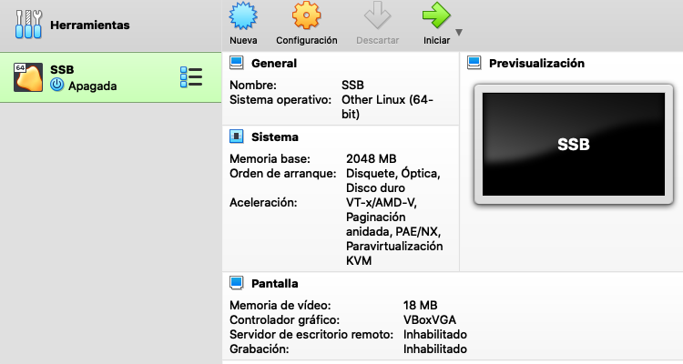

***


En esta sección se muestran los enlaces de descarga y el proceso de instalación de la **Máquina Virtual**.

Adicionalmente, se ofrecen dos alternativas para aquellos que opten utilizar una versión [GNU/Linux](#instalación-manual-de-las-librerías-y-creación-de-ambientes-conda) propia o utilizar [WSL en Windows](#instalación-de-wsl-en-windows).
No obstante, quien decida tomar alguna de estas opciones deberá instalar y configurar los programas por su cuenta. La lista de programas se muestra más adelante.


***
## 1. Máquina virtual del Taller de SMSB 

### Requisitos mínimos de la máquina virtual
- 20 GB de espacio libre en su disco duro.
- 6 GB de RAM.
- Sistema operativo Windows 10 u 8, o mac OS reciente.

### Descarga de VirtualBox y 7zip

1. Descarga e instala **[VirtualBox](https://www.virtualbox.org/wiki/Downloads)** en tu sistema operativo:

> <a href="https://www.virtualbox.org/wiki/Downloads">
    
</a>

2. Descarga e instala **[7zip](https://7zip.es/)**:

> <a href="https://7zip.es/">
    
</a>

### Descarga de la MV

1. Descarga cada una de las siguientes partes de la máquina virtual:

<center>
| Parte      | Enlace | Peso | |
| :-----------: | :-----------: | :-----------: | :-----------: |
| 1      | [SSB.ova.7z.001](https://drive.google.com/file/d/1chN6ToCWuBU9_bwZdV3yZz-zp48NLmp0/view?usp=sharing)       | 650 MB | |
| 2      | [SSB.ova.7z.002](https://drive.google.com/file/d/1MYJVHYptkjdIUHiWCJzZlSUxTI8gsqqs/view?usp=sharing)       | 650 MB | |
| 3      | [SSB.ova.7z.003](https://drive.google.com/file/d/1YIwrOqb4xxVI-uZP5ntGvznUiERV-b_0/view?usp=sharing)       | 650 MB | |
| 4      | [SSB.ova.7z.004](https://drive.google.com/file/d/1ZBrM0OTmaCXne8r_SXfhsx0NLizGBU7Z/view?usp=sharing)       | 650 MB | |
| 5      | [SSB.ova.7z.005](https://drive.google.com/file/d/115bO5OkkugGpkgfEW6WuH3uxRsrY4wlM/view?usp=sharing)       | 650 MB | |
| 6      | [SSB.ova.7z.006](https://drive.google.com/file/d/1-Vq74up40Q4TBI5pJJlRYE2OmZeCnZPG/view?usp=sharing)       | 650 MB | |
| 7      | [SSB.ova.7z.007](https://drive.google.com/file/d/1M7ZI_6b8tCxxIQoworqhP3PpaQitj2G3/view?usp=sharing)       | 650 MB | |
| 8      | [SSB.ova.7z.008](https://drive.google.com/file/d/1fsmdFGb1zdlNY-RvDWE78eD3YAde62pC/view?usp=sharing)       | 650 MB | |
| 9      | [SSB.ova.7z.009](https://drive.google.com/file/d/1DVxzjTxX-dGkgbBa7AbjexuIGpI7PEsh/view?usp=sharing)       | 650 MB | |
| 10     | [SSB.ova.7z.010](https://drive.google.com/file/d/1hj7cvCUoRTkyjtFknRglHNeaECgUMW7N/view?usp=sharing)       | 368 MB | |

</center>

### Instalación de la MV

1. Una vez descargadas las 8 partes, y estando todas en el mismo directorio, abre el archivo **<mark>SSB.ova.7zip.001</mark>** )utilizando **7zip**, y extrae el archivo **<mark>SSB.ova</mark>**. Puedes extraerla en cualquier directorio al que te sea más cómodo acceder. Más adelante podrás eliminar este archivo, si así lo deseas.

2. Abre VirtualBox y en la barra superior selecciona *Archivo > Importar Servicio Virtualizado*. 

3. En la ventana emergente, da click en la sección de Archivo y en el explorador busca y selecciona al archivo **<mark>SSB.ova</mark>**. Da click en ***Siguiente***.

4. Se abrirá una ventana titulada ***Preferencias de servicio*** con los datos de la máquina virtual. Da click en ***Importar***.

5. Acepta la licencia.

6.  El proceso tardará unos minutos.

7.  En la ventana principal de **VirtualBox** tendrás ahora acceso a la MV llamada **<mark>SSB</mark>**.

> <a href="https://www.virtualbox.org/wiki/Downloads">
    
</a>


<div class="alert alert-dismissible alert-success">
<h4 class="alert-heading">Opcional</h4>
 Puedes ir a la opción de Configuración para modificar algunas propiedades de la máquina.  
  Por ejemplo, en **Sistema** puedes modificar la cantidad de memoria RAM asignada a la MV (si tienes suficiente en tu equipo puedes probar aumentando la RAM a 3 GB)
</div>


1. **Listo**  🎉 🎉 🎉.  
La máquina está instalada y puedes "encenderla" haciendo doble click sobre su nombre.  
<mark>La contraseña (password) del superusuario es <i>ssb</i></mark>.


1.    Si hubiese algún problema con la máquina o con el sistema operativo, siempre puedes volver a usar el archivo **<mark>SSB.ova</mark>** para volver a la configuración inicial. Es decir, puedes echarla a perder sin culpa alguna. 

***
### Programas y librerías 

La siguiente es una lista de los programas principales a utilizar en el taller. Estos están ya incluidos en la máquina virtual:

<details>
<summary><b>Da click para desplegar la lista:</b></summary>
```
- Autodock4
- MGLTools
- Smina
- Open Babel
- Amber Tools
- VMD
- UCSF Chimera 
- VIM
- Sublime
- ZSH
- Conda
  - Python 3.8
    - numpy
    - pandas
    - seaborn
    - jupyter
    - pytraj
```
</details>

***
## 2. Instalación de WSL en Windows
Una segunda opción, para los que tienen Windows, es [instalar la terminal de Ubuntu: WSL](https://ubuntu.com/wsl). Recomiendo esta opción sólo si no cuentas con los requisitos mínimos para la máquina virtual.

<div class="alert alert-dismissible alert-warning">
<h4 class="alert-heading">¡Atención!</h4>
  Si optas por esta opción tendrás que instalar manualmente los programas a utilizar. La recomendación es usar conda, así que revisa la siguiente sección para instalar los ambientes y librerías necesarias.
  <b>Lamentablemente no puedo garantizar que todos los programas funcionen adecuadamente a través de esta alternativa.</b>
</div>


***

## 3. Instalación "Manual" de las librerías y creación de ambientes conda

Si ya cuentas con una versión de Linux y quieres hacer la instalación manual de los programas te recomiendo instalar **Conda** o [Miniconda](https://docs.conda.io/en/latest/miniconda.html).
Nuevamente, **esta opción sólo es recomendada para quienes tengan experiencia con Linux** y/o estén dispuestos a resolver los problemas de instalación que puedan llegar a surgir.
A través de **conda** puedes instalar los paquetes y programas antes mencionados. 

> <a href="https://www.anaconda.com/products/individual">
    
</a>

<div class="alert alert-dismissible alert-warning">
  Cada vez que crees un ambiente no olvides activarlo para instalar las librerías en él.
    No olvides tampoco desactivarlo cada vez que necesites usar un nuevo ambiente.
</div>

#### Ambiente Autodock4

Una vez instalado **conda**, crea un ambiente llamado `ad4`:

Crea un ambiente para autodock 4:
```{#numCode .R .numberLines}
conda create -n ad4
conda activate ad4
conda install -c hcc autodock
conda install -c bioconda mgltools
conda deactivate
```

#### Ambiente Smina

Crea uno para **smina** y sofware relacionado con la preparación de las moléculas:

```{#numCode .R .numberLines}
conda create -n dock
conda activate dock
conda install -c conda-forge pdb2pqr openbabel
conda install -c bioconda smina autodock-vina
conda deactivate
```

#### Ambiente AmberTools
Crea un ambiente para dinámica molecular:

```{#numCode .R .numberLines}
conda create -n mds
conda activate mds
conda install -c conda-forge ambertools vmd
conda deactivate
```

#### Ambiente de análisis con python
Crea un ambiente para análisis de datos con python:

```{#numCode .R .numberLines}
conda create -n jup python=3.7 numpy scipy pandas seaborn scikit-learn jupyter 
conda install -c ambermd pytraj
conda deactivate
```

#### Instalación de UCSF Chimera
Descarga e instala UCSF Chimera a través de [este enlace](https://www.cgl.ucsf.edu/chimera/download.html).


***

<!-- hitwebcounter Code START -->
<a href="https://www.hitwebcounter.com" target="_blank">
</a>                                    
                                    
                                        
                                          