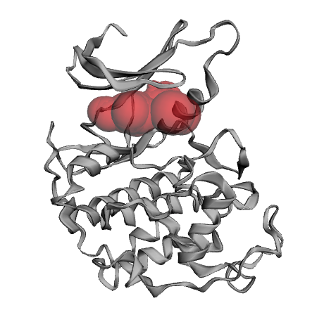
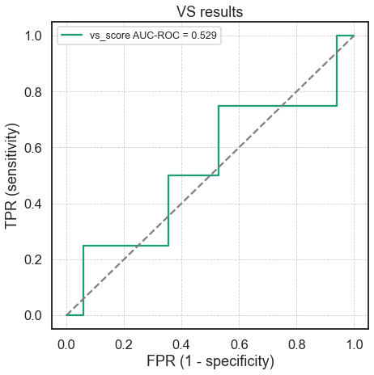
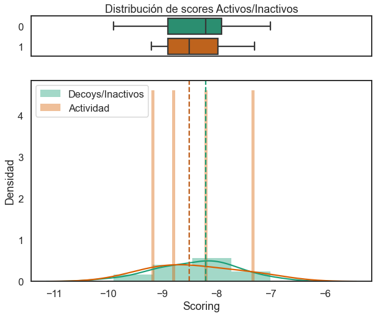

***

# Acoplamiento molecular con Smina

```{r setup, include=FALSE}
library(DiagrammeR)
knitr::opts_chunk$set(echo = TRUE)
```
## Obtención y preparación de las moléculas

1. Crea tu directorio de trabajo:
```{#numCode .R .numberLines}
mkdir wd_vs
cd wd_vs
```

2. **Descarga** el archivo de la proteína y de las moléculas en formato SMILES ⬇️:
   - Proteína: [1fin_PROT.pdb](https://raw.githubusercontent.com/jRicciL/Taller_Simulacion_Molecular/master/resurces/vs/1fin_PROT.pdb)
   - Archivo de ligandos (SMILES): [cdk2_sample.smi](https://raw.githubusercontent.com/jRicciL/Taller_Simulacion_Molecular/master/resurces/vs/cdk2_sample.smi)

3. **Descarga** los siguientes archivos y **guardalos** en tu directorio de trabajo ⬇️ (guárdalos para después):
   - [cdk2_activity_mols.csv](https://raw.githubusercontent.com/jRicciL/Taller_Simulacion_Molecular/master/resurces/vs/cdk2_activity_mols.csv)
   - [plot_metrics.py](https://raw.githubusercontent.com/jRicciL/Taller_Simulacion_Molecular/master/resurces/vs/plot_metrics.py)
   - [analisis_resultados_vina.ipynb](https://raw.githubusercontent.com/jRicciL/Taller_Simulacion_Molecular/master/resurces/vs/analisis_resultados_vina.ipynb)


```
📂 wd_vs
│  🗒 1fin_PROT.pdb
│  🗒 cdk2_sample.smi
│  🗒 cdk2_activity_mols.csv
│  🗒 plot_metrics.py
│  🗒 analisis_resultados_vina.ipynb
```

### Preparación de los ligandos

3. **Extraer** las moléculas del archivo  **<mark>cdk2_sample.smi</mark>** en una nueva carpeta

```{#numCode .R .numberLines}
mkdir ligands
```

```{#numCode .R .numberLines}
obabel -ismi cdk2_sample.smi -omol2 -O ligands/ -m --gen3d -p 7
```

2. Recupera los **nombres originales** de las moléculas

```{#numCode .R .numberLines}
# Entra a la carpeta ligands
cd ligands
```

> Ejecuta el siguiente comando:
```{#numCode .R .numberLines}
# Renombra cada archivo para conservar 
# el nombre original
for i in *; 
do name=`head -n 2 $i | tail -n 1`; 
mv $i $name.mol2; 
done
```

3. Usa `obabel` para **convertir las moléculas** a `pdbqt`:

```{#numCode .R .numberLines}
# Sal de la carpeta ligands al directorio padre
cd ..

# Crea un nuevo directorio para guardar los archivos `pdbqt`
mkdir ligs_pdbqt

# Ejecuta openbabel para **múltiples** inputs
obabel -imol2 ligands/* -opdbqt -O ligands_pdbqt/.pdbqt -m
```

```
📂 wd_vs
|  📜 ...
│  🗒 1fin_PROT.pdb
│  🗒 cdk2_sample.smi
├── 📂 ligands
│   ├── *.mol2
├── 📂 ligands_pdbqt
│   ├── *.pdbqt
```

***
## Preparación del Receptor

1.  Tener el ambiente de conda `dock` **activado** y localizarse en la carpeta de trabajo (`wd_dk`).
2.  Ejecutar **PDB2PQR** con alguno de los siguientes comandos (dependiendo de la versión con la que cuentes):

```{#numCode .R .numberLines}
# Para la versión más reciente
pdb2pqr30 --ff='AMBER' --ffout='AMBER' \
    --with-ph=7.0 --drop-water --keep-chain \
    --pdb-output prot.pdb \
    1fin_PROT.pdb pqr_file.pqr
```

2. Utiliza **Castp** para identificar el mejor candidato al sitio de unión.

> <a href="http://sts.bioe.uic.edu/castp/index.html?4jii">
    
</a>

1. Utiliza **UCSF Chimera** para establecer el tamaño y posición del espacio de búsqueda (puedes utilizar **AutodockTools** si lo deseas).
    1. Abre el archivo `prot.pdb`con UCSF Chimera.
    2. Ve a *Tools > Surface/Binding Analysis > Autodock Vina*
    3. Utiliza el cursor para dibujar la caja en la posición que consideres adecuada.

> <a href="https://www.cgl.ucsf.edu/chimera/docs/ContributedSoftware/vina/vina.html">
    
</a>


1. **Anota las coordenadas** del tamaño y posición del espacio de búsqueda.

```
# Centro
x = -16
y = 205
z = 117

# Dimensiones
x = 21
y = 22
z = 22
```

3. **Convierte** el archivo `pdb` de la proteína a `pdbqt`:

```{#numCode .R .numberLines}
obabel -ipdb prot.pdb -xr -opdbqt -O prot.pdbqt
```

> `-x` es un [argumento](https://openbabel.org/docs/dev/Command-line_tools/babel.html) que permite especificar parámetros específicos del formato de salida, en este caso de `pdbqt`, usando el parámetro [r](https://openbabel.org/docs/dev/FileFormats/AutoDock_PDQBT_format.html).

<div class="alert alert-dismissible alert-warning">
<h4 class="alert-heading">🚨 Sobre las cargas parciales: 🚨</h4>
<ul>
<li>¿Qué tipo de <strong>cargas parciales</strong> estamos usando tanto para la proteína como para los ligandos?</li>
<li>¿Por qué no fue necesario utilizar el script <pm>prepare_ligand4.py</code>?</li>
<li>Revisa el apartado <i>Ease of use</i> del <a href="http://vina.scripps.edu/manual.html"><em>Manual de Autodock vina</em></a></li>
</ul>
</div>

***
## Ejecución de Smina con un único ligando

1. Observa qué parámetros son necesarios para la ejecución de `smina`:

```{#numCode .R .numberLines}
smina --help
```

<pre style='background-color: #ddd;'>
<code >
Input:
  -r [ --receptor ] arg         rigid part of the receptor (PDBQT)
  --flex arg                    flexible side chains, if any (PDBQT)
  -l [ --ligand ] arg           ligand(s)
  --flexres arg                 flexible side chains specified by comma
                                separated list of chain:resid
  --flexdist_ligand arg         Ligand to use for flexdist
  --flexdist arg                set all side chains within specified distance
                                to flexdist_ligand to flexible

Search space (required):
  --center_x arg                X coordinate of the center
  --center_y arg                Y coordinate of the center
  --center_z arg                Z coordinate of the center
  --size_x arg                  size in the X dimension (Angstroms)
  --size_y arg                  size in the Y dimension (Angstroms)
  --size_z arg                  size in the Z dimension (Angstroms)
...
Output (optional):
  -o [ --out ] arg              output file name, format taken from file
                                extension
  --out_flex arg                output file for flexible receptor residues
  --log arg                     optionally, write log file
...
</code>
</pre>

2. Realiza el **primer acoplamiento** con smina:

```{#numCode .R .numberLines}
smina -r prot.pdbqt \
      -l ligands_pdbqt/CS1.pdbqt \
      -o CS1_docked.pdbqt \
      --log CS1_docked.log \
      --center_x -16 \
      --center_y 205 \
      --center_z 117 \
      --size_x 21 \
      --size_y 22 \
      --size_z 22
```

3. Explora los resultados utilizando *UCSF Chimera* o *[AutodockTools](http://autodock.scripps.edu/faqs-help/tutorial/using-autodock-4-with-autodocktools/2012_ADTtut.pdf)*.


```
📂 wd_vs
|  📜 ...
│  🗒 1fin_PROT.pdb
│  🗒 cdk2_sample.smi
├── 📂 ligands
│   ├── *.mol2
├── 📂 ligands_pdbqt
│   ├── *.pdbqt
│  🗒 CS1_docked.pdbqt
│  🗒 CS1_docked.log
```


***
## Múltiples acoplamientos utilizando smina

1. Crea una carpeta para guardar los resultados:

```{#numCode .R .numberLines}
mkdir docks
```

2. Crea un archivo de configuración para definir los parámetros generales: `docking_smina.conf`.

```{#numCode .bash .numberLines}
# Nombre del archivo del receptor
receptor = prot.pdbqt
# Exhaustividad de búsqueda
exhaustiveness = 4
# Posición del centro del grid (en A)
center_x = -16
center_y = 205
center_z = 117
# Dimensiones del espacio de búsqueda (en A)
size_x = 21
size_y = 22
size_z = 22
# Número de cpus
cpu = 2
# Scoring a utilizar
scoring = vina
```

3. Ejecuta **smina** utilizando un ciclo `for`:

```{#numCode .R .numberLines}
for lig in ligands_pdbqt/*.pdbqt;
do name=`basename $lig .pdbqt`;
echo "Ejecutanto para $name";
smina --config docking_smina.conf --ligand $lig --log docks/$name.log --out docks/"$name"_dk.pdbqt;
done
```

4. Funciones de *scoring* disponibles:

```
ad4_scoring
default
dkoes_fast
dkoes_scoring
dkoes_scoring_old
vina
vinardo
```

```
📂 wd_vs
|  📜 ...
│  🗒 1fin_PROT.pdb
│  🗒 cdk2_sample.smi
├── 📂 ligands
│   ├── *.mol2
├── 📂 ligands_pdbqt
│   ├── *.pdbqt
├── 📂 docks
│   ├── *.pdbqt
│   ├── *.log
```

***
## Verifica los resultados:

1. **Inspecciona** uno de los archivos `.log`:

```{#numCode .R .numberLines}
cat docks/CS1.log
```

```
smina is based off AutoDock Vina. Please cite appropriately.

Weights      Terms
-0.035579    gauss(o=0,_w=0.5,_c=8)
-0.005156    gauss(o=3,_w=2,_c=8)
0.840245     repulsion(o=0,_c=8)
-0.035069    hydrophobic(g=0.5,_b=1.5,_c=8)
-0.587439    non_dir_h_bond(g=-0.7,_b=0,_c=8)
1.923        num_tors_div

Using random seed: -1773553296

mode |   affinity | dist from best mode
     | (kcal/mol) | rmsd l.b.| rmsd u.b.
-----+------------+----------+----------
1       -7.3       0.000      0.000
2       -6.9       4.809      6.736
3       -6.8       3.713      6.878
4       -6.5       2.142      2.726
5       -6.3       4.802      7.096
6       -5.9       4.830      7.270
7       -5.9       4.721      6.108
8       -5.8       6.136      6.929
9       -5.8       5.366      6.335
```

2. De cada archivo `.log` nos suele interesar **sólo el valor de energía del primer modo de unión**, es decir, del mejor acoplamiento.

- Busca y devuelve en el archivo `docks/CS1.log` la primera ocurrencia (`-m 1`) del texto  `'1   '`
  
```{#numCode .R .numberLines}
grep '1    ' -m 1 docks/CS1.log
```

```
1       -7.3       0.000      0.000
```

- Añadimos el comando `tr -s ' '`:

```{#numCode .R .numberLines}
grep '1    ' -m 1 docks/CS1.log
```

```
1 -7.3 0.000 0.000
```

- Finalmente añadimos el comando `cut` que **delimitará** la cadena de texto `1 -7.3 0.000 0.000` por espacios en blanco (`'d ' '`) y devolverá **únicamente la columna 2** (`-f2`):

```{#numCode .R .numberLines}
grep '1    ' -m 1 docks/CS1.log | tr -s ' ' |  cut -d ' ' -f2
```

```
-7.3
```

1. Usamos nuevamente un clico para **generar los resultados** que nos interesan:

```{#numCode .R .numberLines}
for dklog in docks/*log;
do echo "Procesando ligando $dklog";
result=`grep '1    ' -m 1 $dklog | tr -s ' ' |  cut -d ' ' -f2`;
echo $result;
done
```

```
Procesando ligando docks/CS1.log
-7.3
Procesando ligando docks/CS100.log
-9.1
Procesando ligando docks/CS102.log
-9.9
Procesando ligando docks/CS154.log
...
```

1. Usa el mismo ciclo for para guardar los resultados en **un único archivo** llamado **<mark>vs_results.csv</mark>**:

- Creamos el archivo `csv`:

```{#numCode .R .numberLines}
echo "ligando,score" > vs_results.csv
```

- Ejecutamos nuevamente el ciclo:
```{#numCode .R .numberLines}
for dklog in docks/*log;
do echo "Procesando ligando $dklog";
result=`grep '1    ' -m 1 $dklog | tr -s ' ' |  cut -d ' ' -f2`;
# Agregamos estas líneas;
name=`basename $dklog .log`;
echo "$name, $result" >> vs_results.csv;
echo $result;
done
```

- Cuida **no ejecutar el ciclo múltiples** veces para evitar duplicar resultados.

5. **Visualiza** el resultado:

```{#numCode .R .numberLines}
head vs_results.csv
```

```
ligando,score
CS1, -7.3
CS100, -9.1
CS102, -9.9
CS154, -8.8
CS16, -8.2
CS160, -8.3
CS261, -8.8
CS262, -9.2
CS47, -7.9
```

***
# Análisis de los resultados con jupyter

> <a href="https://jupyter.brynmawr.edu/services/public/dblank/Jupyter%20Notebook%20Users%20Manual.ipynb">
    
</a>

1. Activa el **ambiente** `jup`con conda.
2. Asegurate de haber **descargado** y **guardado** en tu carpeta de trabajo los archivos:
   - cdk2_activity_mols.csv
   - plot_metrics.py
   - analisis_resultados_vina.ipynb

3. **Inicia** el servidor de *jupyter*:

```{#numCode .R .numberLines}
jupyter notebook
```

4. Se abrirá el explorador de internet y tendrás acceso a la interfaz de *jupyter*.
5. Abre el archivo `analisis_resultados_vina.ipynb`
6. En la celda de ejecución número 2, asegurate que el nombre del archivo de resultados `.csv`sea el correcto:

```{#numCode .python .numberLines}
# Carga de los resultados de vina
dk_res = pd.read_csv('./vs_results.csv')
dk_res.head()
```

7. Ejecuta el notebook mediante *Cell > Run All*

### Resultados del notebook

#### Ranking de moléculas:

```{#numCode .python .numberLines}
# Ejecutar dentro del notebook
vs_res = PlotMetric(y_true = df.actividad, 
                    y_pred_dict = {'smina': df.score})
vs_res.plot_actives_distribution(add_to_title='')
```

> 


***
#### Curva ROC y Área bajo la curva ROC

```{#numCode .python .numberLines}
# Ejecutar dentro del notebook
vs_res.plot_roc_auc(title='VS results',
                    fontsize='x-small', 
                    show_by_itself = False)
```

> 

***
#### Distribución de los scores entre Activos e Inactivos

```{#numCode .python .numberLines}
compare_two_distributions(df)
```

```
Normalidad Activos (ShapiroWilks)
'> W = 0.96 , p-value=0.81'

Normalidad Inactivos (ShapiroWilks)
'> W = 0.98 , p-value=0.9818'

Prueba de Bartlett para Homocedasticidad
'> W = 0.08 , p-value=0.7758'

t-student para pruebas independientes
'> t = -0.04 , p-value=0.9691'

Mann-Whitney (no paramétrica)
'> W = 32.0 , p-value=0.4464'
```

> 


## Recursos

1. Sobre curvas ROC:


> [](https://www.youtube.com/watch?v=4jRBRDbJemM&ab_channel=StatQuestwithJoshStarmer "Docking desde cero. Tutorial AutodockTools")  
